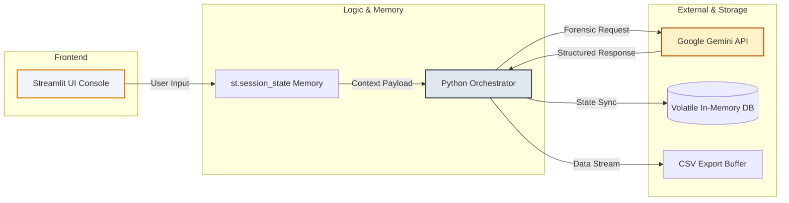

# ⚡ Zeus.ai — Divine Identity Citadel

A centralized, national-level counter-identity theft and advanced fraud intelligence system engineered to intercept synthetic document exploitation, credential manipulation, and deepfake verification bypass vectors.

## 🚀 Core System Capabilities
* **📊 Aegis Identity Matrix:** High-performance operator dashboard analyzing active threat telemetry.
* **🚨 Threat Incident Portal:** Standardized reporting window routing parsed event payloads into a structured CSV ledger stream.
* **📄 Neural Document Inspection:** Multimodal visual forensics powered by generative intelligence to identify edge alterations, layout mismatches, and font anomalies.
* **⚖️ Scale of Themis:** Adaptive risk metrics combining network, behavioral, and verification signals to trigger access isolation protocols.
* **🏺 Pandora's Vault:** Active decoy deployment framework hosting synthetic assets to capture and fingerprint malicious scrapers.

## 🏗️ Technical Infrastructure

| Component | Technology | Scope |
| :--- | :--- | :--- |
| **Frontend UI** | Streamlit | Responsive web console elements |
| **Cognitive AI** | Google Gemini SDK | Multimodal image inspection and strategic context mapping |
| **Data Engine** | Pandas | Tabular analytics mutations and local export streaming |
| **Security Core** | Hashlib | Deterministic signature hashing for sentinel logins |

## 🏗️ System Architecture & Data Flow

## 🛡️ Data Privacy & Ethical AI Compliance
This project strictly conforms to the Data Privacy Guidelines on **Page 35 of the Code-A-Thon Brochure**:
1. **Zero-Retention Processing:** Uploaded identification media streams are handled completely within volatile RAM as binary byte clusters.
2. **Encrypted Sockets:** Assets are transmitted using secure HTTPS RPC layers directly to model endpoints and are instantly destroyed post-inference.
3. **Synthetic Sanitization:** The Honeypot Ledger and fraud trackers use synthetic dummy profiles to ensure no genuine personal data is stored or exposed.

## 🛠️ Deployment
1. Install dependencies: `pip install -r requirements.txt`
2. Run the application: `streamlit run app.py`
